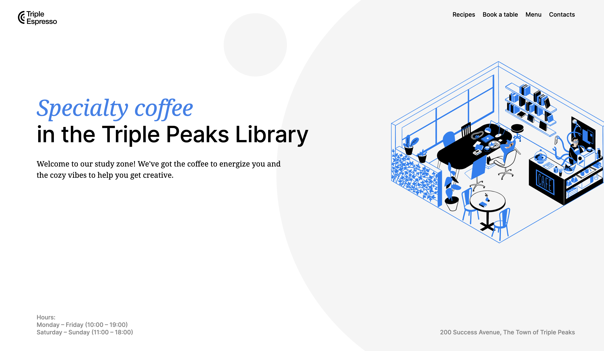
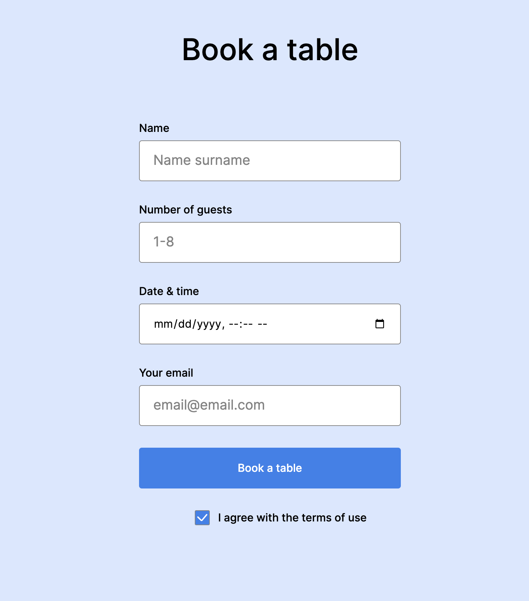

# Triple Peaks Coffee Shop

This is the second project of the Software Engineering program at TripleTen. It was created using HTML and CSS, based on the design brief and includes the optional customized button.

## Project features

- Semantic HTML5
- Flexbox
- Positioning
- Flat BEM file structure
- A custom form
- CSS animation and transform

## Plan on improving the project

Some ideas for improving the project:

- I would add vendor prefixes to the css for cross-browser compatibility to ensure all browsers can see all features of the site.
- I would have the video loop so as to give a preview to the viewer and help increase clicks and interest.
- I'd also like to learn how to add a parallax scrolling effect to engage the customer with the information and increase sales conversion rates, or at least more animations.
